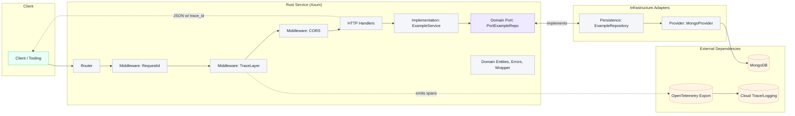
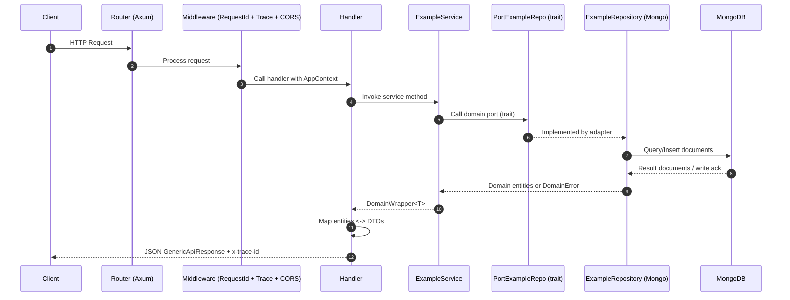
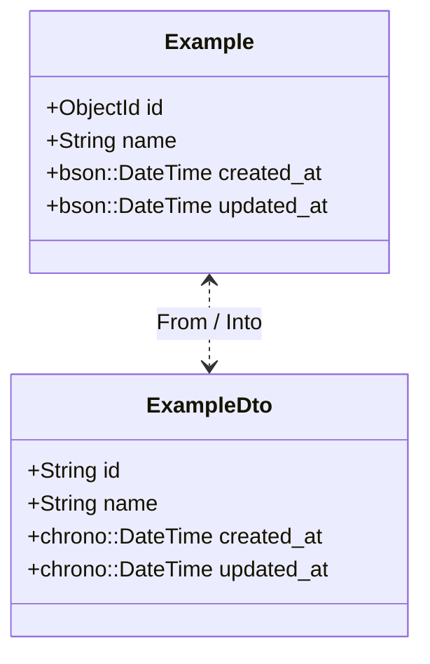

# Infrastructure and Architecture Guide

This document explains how this Rust microservice template is structured and how its parts communicate: domains, ports, repositories, services, infrastructure, transport, observability, and DTO outputs. It includes diagrams to visualize the flow.

The template follows Clean/Hexagonal Architecture:
- Domain: pure business model and ports (interfaces).
- Implementation: services/use-cases orchestrating domain behavior.
- Infrastructure: adapters and providers (HTTP server, persistence, external systems).

---

## High-Level Overview



Key ideas:
- The HTTP layer calls handlers, which call services in the implementation layer.
- Services depend on domain ports (traits).
- Infrastructure provides adapters that implement those ports (e.g., Mongo repository).
- Observability is wired through tracing and a request ID middleware.

---

## Directory Layout and Responsibilities

- src/domain
  - entities: Pure domain models (e.g., Example).
  - ports: Traits defining external interactions (e.g., PortExampleRepo).
  - serializer: Utilities for domain-level serialization (e.g., Pub/Sub decoding).
  - error.rs: DomainError variants (NotFound, Conflict, Validation, Transient, Unknown).
  - wrapper.rs: DomainWrapper<T> = Result<T, DomainError> and conversions.

- src/implementation
  - example_service.rs: Orchestrates domain operations through ports.
  - mod.rs: Export service(s).

- src/infrastructure
  - http
    - dto: Input/Output DTOs, marker traits.
    - handlers: Axum request handlers that map to services and DTOs.
    - middlewares: RequestId middleware for trace correlation, plus tracing and CORS.
    - routes.rs: Router creation and endpoint wiring.
    - response.rs: GenericApiResponse wrapper for all HTTP responses.
  - persistence
    - example_repo.rs: MongoDB adapter implementing PortExampleRepo.
  - providers
    - prv_mongo.rs: MongoProvider (creates and validates DB connection).
    - Other optional providers (Pub/Sub, Storage, Tasks, Redis) are present but not wired.

- src/tools
  - tracer.rs: OpenTelemetry setup for GCP Cloud Trace.
  - dbg.rs: Logger initialization (Stackdriver layer + OTel layer).

- src/envs.rs
  - Centralized environment configuration loader.

- src/main.rs
  - App wiring: load env, init tracing/logging, create providers, repositories, services, context, and the HTTP server.

---

## Runtime Topology and Ports

- Inbound:
  - HTTP server listens on 0.0.0.0:PORT (default 8080).
- Outbound:
  - MongoDB at MONGO_URL (default Mongo port is 27017).
- Observability:
  - Tracing/logging exported to Google Cloud if credentials and PROJECT_ID are present; otherwise, logs are local without trace export.

---

## HTTP Surface

Configured in the HTTP router:
- GET /healthz: liveness indicator, returns "ok".
- GET /api/v1/example: list all examples.
- POST /api/v1/example/random: insert a randomly named example.
- GET /api/v1/example/error: example endpoint that returns a failure via DomainError.

Middlewares:
- RequestIdLayer: attaches a unique request/trace identifier; response includes header x-trace-id when tracing context is valid.
- TraceLayer: attaches a tracing span with HTTP method, URI, and request id.
- CORS: permissive CORS policy enabled.

---

## Request Flow (Sequence)



---

## Domain ↔ Ports ↔ Adapters

- Port: `PortExampleRepo` defines the repository interface:
  - `all() -> DomainWrapper<Vec<Example>>`
  - `insert(example) -> DomainWrapper<Example>`

- Adapter: `ExampleRepository` (Mongo) implements the port:
  - Uses `examples` collection.
  - Creates indexes on created_at and updated_at (both descending).
  - Sets `id`, `created_at`, and `updated_at` on insert.

```mermaid
flowchart LR
    subgraph Domain
      P[PortExampleRepo (trait)]
      E[Entity: Example]
      Err[DomainError]:::warn
    end
    subgraph Implementation
      S[ExampleService]
    end
    subgraph Infrastructure
      A[ExampleRepository (Mongo)]
      M[MongoProvider]
    end

    S --> P
    P <.. A
    A --> M

    classDef warn fill:#FFECEC,stroke:#FF6B6B,color:#1B2430
```

---

## Data Contracts (DTOs) and HTTP Responses

DTOs:
- `ExampleDto` is the wire-format counterpart of the domain `Example` entity.
  - Converts from/to domain entity.
  - Uses string IDs and chrono timestamps for JSON friendliness.

Response Wrapper:
- `GenericApiResponse<T>` is returned for every handler response:
  - success: boolean
  - trace_id: string (from current tracing span)
  - data: optional payload (present on success)
  - cause: optional error message (present on failure)

Status Codes:
- 200 OK when success = true.
- 500 Internal Server Error when success = false.
  - You can later map `DomainError` variants to more specific status codes if desired.

Headers:
- When tracing is active, responses include `x-trace-id` for correlation.

Example: success response (GET /api/v1/example)
```json
{
  "success": true,
  "trace_id": "4e2f8b6c0a1d4b3b8f9d0c1a2b3c4d5e",
  "data": [
    {
      "id": "656ba8d8f2a6b85e2a65cafe",
      "name": "example-12345",
      "created_at": "2024-01-01T10:00:00Z",
      "updated_at": "2024-01-01T10:00:00Z"
    }
  ]
}
```

Example: error response (GET /api/v1/example/error)
```json
{
  "success": false,
  "trace_id": "4e2f8b6c0a1d4b3b8f9d0c1a2b3c4d5e",
  "cause": "example error"
}
```

Entity ↔ DTO mapping:


---

## Observability

- Tracing:
  - OpenTelemetry tracer is initialized with the service name.
  - If a Google Cloud Project ID is present and credentials are available, traces are exported to Cloud Trace.
  - A `TraceLayer` enriches spans with method, uri, and request_id.

- Logging:
  - Uses `tracing` with a Stackdriver-compatible layer.
  - Controlled by `DEBUG_LEVEL` (e.g., TRACE, DEBUG, INFO, WARN, ERROR).
  - When tracing is active, logs are correlated with trace context.

- Correlation:
  - Middleware adds a `x-trace-id` header when the current trace id is valid.
  - The same trace id appears in `GenericApiResponse.trace_id`.

---

## Database

- MongoProvider:
  - Connects to the database using `MONGO_URL`.
  - Pings the database to validate the connection.
  - Provides a cloneable `Database` handle.

- ExampleRepository:
  - Collection: `examples`.
  - Indexes on `created_at` and `updated_at` (desc).
  - Insert:
    - Assigns a new `ObjectId`.
    - Sets `created_at` and `updated_at` to `Utc::now()`.

---

## Environment Variables

Required:
- SERVICE_NAME: Name used by tracing.
- MONGO_URL: MongoDB connection string.
- MONGO_DB: Database name.

Optional:
- PORT: Defaults to 8080.
- PROJECT_ID: GCP project for Cloud Trace/Logging integration.
- DEBUG_LEVEL: e.g., INFO (default), DEBUG, TRACE, WARN, ERROR.

Example `.env`:
```
PORT=8080
SERVICE_NAME="my-rust-service"
PROJECT_ID="your-gcp-project-id"
MONGO_URL="mongodb://localhost:27017"
MONGO_DB="my_database"
DEBUG_LEVEL="INFO"
```

---

## End-to-End: Example Calls

- Health:
  - GET http://localhost:8080/healthz

- List examples:
  - GET http://localhost:8080/api/v1/example

- Insert random example:
  - POST http://localhost:8080/api/v1/example/random

- Trigger an example error:
  - GET http://localhost:8080/api/v1/example/error

---

## Extending the Template

When adding a new feature/domain:

1) Domain
- Create entity(ies) under `src/domain/entities`.
- Define a port (trait) in `src/domain/ports` that represents the domain’s needs from the outside world.
- Use `DomainError` and `DomainWrapper<T>` for consistent error handling.

2) Infrastructure Adapter
- Implement the port under `src/infrastructure` (e.g., persistence, provider, http client).
- Keep technology-specific details here (schemas, queries, SDK calls).

3) Implementation Service
- Add a service in `src/implementation` that orchestrates domain logic and calls the port.
- Return `DomainWrapper<T>` from service methods.

4) HTTP Layer
- Add handlers in `src/infrastructure/http/handlers`.
- Map domain entities to DTOs in `src/infrastructure/http/dto`.
- Return `GenericApiResponse<T>` from handlers.
- Wire route(s) in `src/infrastructure/http/routes.rs`.

5) Composition
- Register providers, repositories (port implementations), and services in `main.rs`.
- Add them to `AppContext` and pass into the router as state.

6) Observability
- Use `#[tracing::instrument]` on async methods to get spans for free.
- Include relevant fields in spans and logs for better diagnostics.

---

## Component Map (Modules)

```mermaid
flowchart TB
    subgraph Domain
      D1[entities]
      D2[ports]
      D3[error + wrapper]
      D4[serializer]
    end

    subgraph Implementation
      I1[ExampleService]
    end

    subgraph Infrastructure
      H1[http/dto]
      H2[http/handlers]
      H3[http/middlewares]
      H4[http/routes]
      H5[http/response]
      P1[persistence/ExampleRepository]
      PV1[providers/MongoProvider]
    end

    subgraph Tools
      T1[tools/tracer]
      T2[tools/dbg (logger)]
    end

    I1 --> D2
    P1 --> D2
    H2 --> I1
    H4 --> H2
    H4 --> H3
    H2 --> H1
    P1 --> PV1
    H1 --> H5

    T1 --> H3
    T1 --> H4
    T2 --> H3
```

---

## Notes and Recommendations

- HTTP error mapping: Currently, any domain error returns HTTP 500. You can refine by mapping `DomainError::Validation` to 400, `NotFound` to 404, etc.
- DTO policy: DTOs are decoupled from domain entities, enabling versioned/public contracts without leaking persistence types.
- CORS: Defaults to permissive. Tighten it for production.
- Security: Add authentication/authorization middleware as needed.
- Providers: Additional providers (Pub/Sub, Storage, Tasks, Redis) exist and can be wired up similarly to MongoProvider as your needs grow.

---

This guide should give you a clear mental model of where things go and how they communicate, so you can confidently extend the template while keeping a clean separation of concerns.
